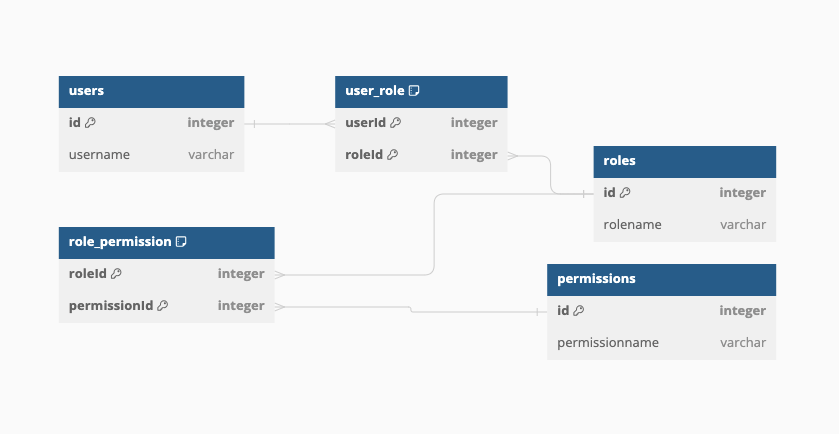

## Installation

In the root folder

```bash
$ docker-compose up -d
$ npm install
```

Inside src folder, create the database, tables, and fill them with test data following the commands below:

```bash
$ npx sequelize-cli db:create
$ npx sequelize-cli db:migrate
$ npx sequelize-cli db:seed:all
```

## Running the app

```bash
# development
$ npm run start
```

## Geting user permissions by id
```bash
curl  -X GET \
  'http://localhost:3000/users/1/permissions' \
  --header 'Accept: */*'
```

## Test

```bash
# unit tests
$ npm run test
```

## Database schema

Database in 3NF as follows:
For each table, transitive dependency was removed, so none non-prime attribute is dependent on another non-prime attribute.


